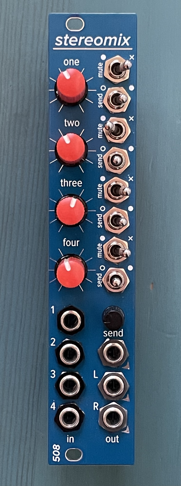

# stereomix

The stereomix is a 4-in, 3-out stereo Eurorack mixer in 5HP (oriented vertically) or 22HP in 1U orientation. 

It has a couple of unique features for a mixer this size: 
* individual mutes per channel
* switched EFX send (off / less / more) per channel
* master EFX send volume pot
* subtle stereo panning tied to the gain pot setting

That's right: you get a little bit of left-/right spread whether you like it or not -- at full high/low settings on the gain pot, you'll wind up with a stereo field positioning somewhere around 10:30 / 1:30.

5HP oriented vertically, or 22HP in 1U orientation, 35mm deep, 43mA +12V, 43mA -12V

This module, like many of my modules, uses 2mm-pitch male/female headers. Be sure you order/use the right thing!
